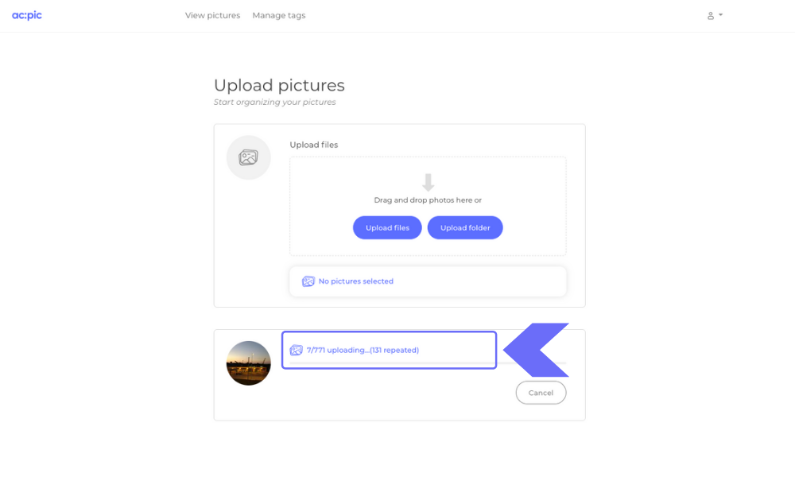

Duplicate pictures take up space and make your photos organization a mess. Eliminate duplicate photos and videos online. No effort, get 2GB for free.
# Remove duplicate photos online

Duplicate photos take up space. But that's not the main problem: **too many duplicates can make your organization a mess**. You may have duplicate copies of the same pictures scattered in different folders in your drive. In such a case, if you search a file by name, you may end up finding different versions.

The most used cloud services for photos, like <a href="https://support.google.com/photos/thread/3954223?hl=en" target="_blank">Google Photos</a> or <a href="https://help.dropbox.com/installs-integrations/sync-uploads/duplicate-files" target="_blank">Dropbox</a>, don’t have a reliable process to identify and eliminate duped photos. Mostly, they rely either on checking if two or more files have the same filename or check the metadata. As we all know, filenames sometimes get a (1), (2), (3), etc. at the end of the name whenever they are duplicated, so the filename is different - or different apps give the same pic a different name-; and metadata is unreliable for understanding if 2 images are duplicates (like when you take photos on ‘burst mode’ with your phone).

So, **how can you identify and eliminate duplicate photos without having to install any software, add-on or pay?**

##The best way to identify and eliminate duplicate photos and videos
Log in to <a href="https://altocode.nl/pic/" target="_blank">ac;pic</a> and upload your pictures. The system automatically identifies and eliminates duplicate photos and videos. How? To begin with, **we don’t look at the filenames or metadata.** We designed ac;pic to check if each photo and video being uploaded have the same <a href="https://en.wikipedia.org/wiki/Pixel" target="_blank">pixels</a> as any other picture in your account. If so, then it’s duplicated, and you don’t need it. It gets automatically deleted. That’s it. You don’t have to do anything, the system does it for you. A collection of unique pics and vids with no effort.

##What can you do with your deduplicated photos and videos?
You can download your freshly deduplicated photos and videos (by the way, we don’t compress nor modify your images and videos quality; we don’t touch the metadata. We don’t modify your images and videos in any way), or if you want to <a href="https://altocode.nl/blog/how-to-organize-digital-photos-for-good" target="_blank">enjoy the organization system we built into ac;pic,</a> you can stay and take advantage of a nicely organized photo collection. You get 2 GB for free to do whatever you want.

###This is how easy it is:

We designed <a href="https://altocode.nl/pic/" target="_blank">ac;pic</a> to run in any browser, so compatibility is never an issue.

