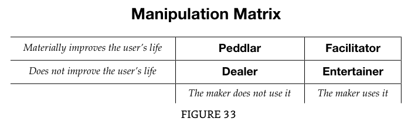

Instead of ‘entrepreneur’, ‘founder’ or ‘developer’, we should see ourselves as 'facilitators'. Improve our lives first, to then improve the life of others.
# Facilitator 

Eyal, Nir. Hooked: How to Build Habit-Forming Products. (p. 171). Penguin Publishing Group.

> “When you create something that you would use, that you believe makes the user’s life better, you are facilitating a healthy habit. It is important to note that only you can decide if you would actually use the product or service, and what “materially improving the life of the user” really means in light of what you are creating.” [1]

> “In building a habit for a user other than you, you cannot consider yourself a facilitator unless you have experienced the problem firsthand.” [2]

> “The role of facilitator fulfills the moral obligation for entrepreneurs building a product they will themselves use and that they believe materially improves the lives of others.” [3]

--

What if we think of ourselves not as an ‘entrepreneur’, ‘founder’, ‘developer’, or any other label, but instead as a ‘facilitator’? **Our job is to make an action or process easy or easier.** First for ourselves. If our life improves, it would probably improve for others.  

---

- [1] [2] [3] Eyal, Nir. <a href="https://www.nirandfar.com/hooked/" target="_blank">Hooked: How to Build Habit-Forming Products.</a> Penguin Publishing Group.

